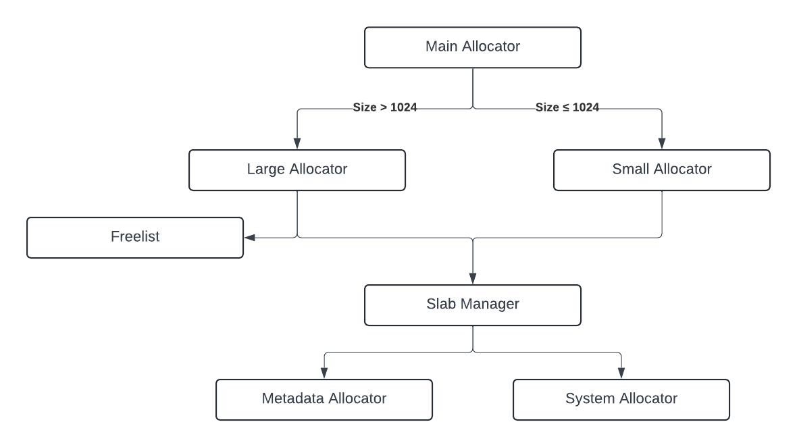

## ckmalloc overview

ckmalloc is a dynamic memory allocator that implements the libc malloc API and C++ new/delete API.

### Memory layout

ckmalloc manages multiple "heaps" (large spans of `mmap`ped memory from the OS). Metadata is held in separate heaps from memory given to the user (see [Metadata Manager](#metadata-manager)).

The heaps containing blocks given to the user are managed by the [Slab Manager](#slab-manager), which is responsible for giving out pages of memory to other components of the allocator. The [large](#large-allocator) and [small](#small-allocator) both request pages of memory from the Slab Manager when they run out of memory, and return pages of memory back to the Slab Manger when they are no longer needed.

Here is a flow chart of the different components of ckmalloc:

### Small Allocator

The small allocator is responsible for allocations under a certain size. Sizes are grouped into "size classes", which are particularly chosen sizes based on both profiles of the traces in `traces/` and memory fragmentation per divisibility of sizes into the heaps they are packed into.

The small allocator manages many [slabs](#slabs) each containing a single size class of equally-sized allocatable memory regions. I.e., for size class 16, there are 256 memory slices packged contiguously in a single page of memory.

Free slices are kept in an unrolled linked list of free slices. Slices are identified by their index in the array of slices in the slab, so for 8- and 16-byte slices, the index is 2 bytes (number of elements >= 256 for both), and all other size classes use an index size of 1 byte. The nodes of the freelist are the free slices themselves, and each node holds as many ids of other slices in the freelist as can fit. So for 16-byte slices, each node can hold 8 other ids (16 / 2), and for 32-byte slices, each node can hold 32 other ids (32 / 1).

The small allocator has a list of all of the slabs containing free slices for each size class, making it very easy to find a free block of a particular size class. If there are no free slices of a particular size class, the small allocator will create a new slab for that size class, requesting memory from the [Slab Manager](#slab-manager).

### Large Allocator

The large allocator manages all other allocation sizes not supported by the small allocator.

Most allocations will be held in "blocked slabs", which are regions of memory with variable-sized blocks. Each block in blocked slabs have an 8-byte header that holds the size of the block, whether it is free, and whether the block before it is free. If the block before it is free, then the 8 bytes immediately before the header hold the size of the previous block (allowing blocks to find their neighbors for "coalescing" when they are freed).

The free blocks in blocked slabs are tracked in the [Freelist](#freelist). The freelist is used for quickly finding blocks large enough to hold an allocation of a certain size.

When the large allocator receives an allocation request, it first checks the freelist for the smallest block of memory large enough to hold the request. If a block is found, it asks the freelist to "split" the block in two, which sizes the block to exactly the requested size and returns the remainder of the block to the freelist. If no such block is found, then the large allocator requests a new slab of memory from the [Slab Manager](#slab-manager) that is large enough to hold the request, and adds the leftover memory at the end of the slab to the freelist as a free block.

#### Page-multiple allocations

The large allocator treats page-multiple size requests slightly differently. For all size requests for which adding metadata/alignment adjustments would require an additional page to fit (i.e. allocation sizes "close to" or equal to a multiple of page size), they are placed in special slabs called "Page Multiple" slabs. These are not "blocks" like in blocked slabs, as they have no headers, and the type of slab metadata associated with the pages spanned by the allocation is different to indicate this.

#### Huge allocations

For allocations above a very large threshold, the large allocator will request memory directly from the system allocator (i.e. `mmap`). This is to avoid very large blocks from severely fragmenting heaps. The smaller this threshold is made, the better memory utilization becomes, but at the cost of performance, as making a syscall and making new virtual memory mappings is very expensive. The threshold was chosen so that performance was hardly impacted, and memory utilization improved significantly.

### Freelist

The freelist is responsible for tracking all free blocks in blocked slabs. Blocked slabs are variable sized, with 8-byte headers at the beginning indicating their size.

Up to a certain size, the freelist has many linked lists of blocks (named "bins") of exactly a certain size (all blocks must be sized to a multiple of 16). When searching for a block of a certain size, it can be expensive to iterate over all bins starting from the requested size and going up. To speed this up, especially in the case where many bins are empty, we have a "skiplist", which is a bit set that maps to the exact-size bins, with bits set for bins that ~may be~ empty. Then, to find a block of a certain size, we start iterating over the skiplist (which reduces to an `absl::countl_zero`), checking only bins with their bit set. If those bins are found to be empty, we clear the bit in the skiplist and keep looking. By clearing the bit here, we can avoid checking if lists are empty every time a block is taken from a bin.

Beyond the maximum size of these exact-sized bins, the remaining larger blocks are held in a red black tree sorted by size (see [Intrusive Red-Black Tree](#intrusive-red-black-tree)).

### Slab Manager

The slab manager is the interface both the small and large allocators use to allocate memory by pages. It tracks all free page-multiple spans of memory in each heap, holding these free regions in a red-black tree sorted by size (except single-page regions which are held in their own list). Allocation of page-multiple spans of memory is done by searching the tree for the smallest free span large enough to hold the request. If no such span is found, the slab manager allocates a new heap from the system allocator (which calls `mmap`).

### Slab Map

The slab map is a 3-level lookup table from allocated pointers to the slab metadata managing the region of memory containing the pointer. The nodes of the slab map are allocated through the [metadata manager](#metadata-manager). The nodes can be freed and later reused when heaps are deallocated, all of which is handled within the slab manager (as the metadata manager is an allocate-only allocator).

Userspace virtual memory address space on most linux systems only spans ~48 bits, and the page size is typically 4096 (12 bits). This leaves ~36 bits needed for Page Ids. The slab map has 3 levels of nodes, each with ~2^12 entries. The first two levels contain only pointers to the levels below, and the last level holds pointers to the metadata for the slab that contains the corresponding page. See [Slabs](#slabs) for more information on the different types of slabs.

Lookup from pointers alone is needed since `free` is not required to give a size hint, and small allocaations do not have any metadata near the freed pointer.

### Metadata Manager

### Slabs

### Intrusive Red-Black Tree
